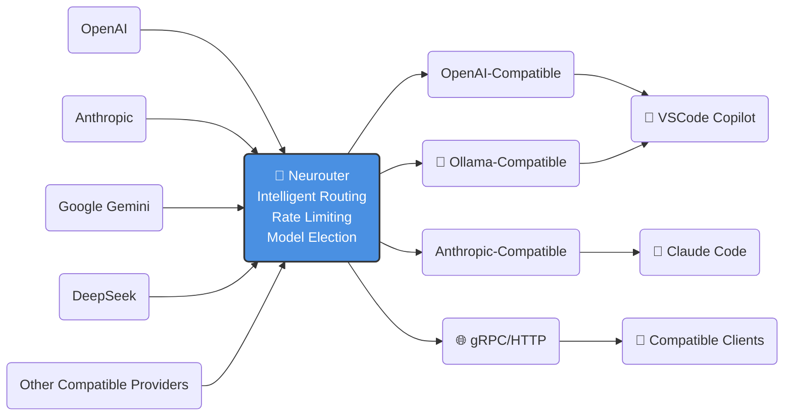

# Neurouter

Neurouter is a powerful LLM router that provides a unified interface for multiple Large Language Model providers. It acts as a proxy service that can route requests to various AI model providers while presenting multiple compatible API interfaces to clients.



## Features

- 🔄 **Multi-Protocol API Support**:
  - Native gRPC API (port 9000)
  - Native HTTP/REST API (port 8000)
  - OpenAI-compatible API
  - Anthropic-compatible API (for Claude Code)
  - Ollama-compatible API
- 🌐 **Multiple Upstream Provider Support**:
  - OpenAI
  - Anthropic
  - Google (Gemini)
  - Any OpenAI-compatible service (e.g., DeepSeek)
  - Neurouter (for chaining instances)
- 🚦 **Advanced Rate Limiting**:
  - Requests Per Minute (RPM)
  - Requests Per Day (RPD)
  - Tokens Per Minute (TPM)
  - Tokens Per Day (TPD)
  - Concurrent request limits
  - Per-upstream and per-model level controls
- 🎯 **Intelligent Model Selection**:
  - Automatic model election with load balancing
  - Probe-Rank-Reserve strategy for optimal model selection
  - Shuffled available candidates for even distribution
- ⚡ **High Performance**: Efficient request routing and streaming support
- 🛠 **Configurable**: Flexible configuration through YAML files

## Installation

### Prerequisites

- Go 1.26.0 or later
- Docker (optional)

### Building from Source

```bash
# Clone the repository
git clone https://github.com/neuraxes/neurouter.git
cd neurouter

# Build the binary
make build
```

### Using Docker

#### Using Prebuilt Container

```bash
# Run container with your configuration
# Note: Server configuration is included in the container by default
docker run -d \
  --name neurouter \
  -p 8000:8000 \
  -p 9000:9000 \
  -v $(pwd)/configs/upstream.yaml:/configs/upstream.yaml \
  ghcr.io/neuraxes/neurouter:latest
```

#### Building from Dockerfile

```bash
# Build image locally
docker build -t neurouter .

# Run container
docker run -d \
  --name neurouter \
  -p 8000:8000 \
  -p 9000:9000 \
  -v $(pwd)/configs/upstream.yaml:/configs/upstream.yaml \
  neurouter
```

## Configuration

Neurouter uses two main configuration files:

### Server Configuration (`configs/config.yaml`)

Configures the HTTP and gRPC server endpoints:

```yaml
server:
  http:
    addr: 0.0.0.0:8000
    timeout: 600s
  grpc:
    addr: 0.0.0.0:9000
    timeout: 600s
```

### Upstream Configuration (`configs/upstream.yaml`)

The upstream configuration defines available models, their properties, and rate limiting rules:

```yaml
upstream:
  configs:
    - name: "provider-name"
      models:
        - id: "model-id" # Unique identifier for the model
          upstream_id: "model-id" # Model ID in the upstream service
          name: "Model Name" # Display name
          owner: "owner" # The entity that owns the model
          provider: "provider" # The model service provider
          modalities: # Supported modalities
            - "MODALITY_TEXT"
            - "MODALITY_IMAGE"
          capabilities: # Model capabilities
            - "CAPABILITY_CHAT"
            - "CAPABILITY_EMBEDDING"
          scheduling: # Per-model rate limits (optional)
            tpm_limit: 100000 # Tokens per minute
            tpd_limit: 1000000 # Tokens per day
            rpm_limit: 60 # Requests per minute
            rpd_limit: 1000 # Requests per day
            concurrency_limit: 5 # Max concurrent requests
      scheduling: # Upstream-level rate limits (optional)
        tpm_limit: 1000000
        tpd_limit: 10000000
        rpm_limit: 600
        rpd_limit: 10000
        concurrency_limit: 50
      providerSpecific: ...
```

Rate limiting works at both upstream and model levels. Model-level limits are applied first, then upstream-level limits. Set to 0 to disable specific limits.

See: [Upstream Providers](#upstream-providers) for detailed provider-specific configurations.

## Usage

### OpenAI-Compatible API

Neurouter exposes an OpenAI-compatible REST API on the HTTP port:

```bash
# List models
curl http://localhost:8000/v1/models

# Chat completion
curl -X POST http://localhost:8000/v1/chat/completions \
  -H "Content-Type: application/json" \
  -d '{
    "model": "gpt-4",
    "messages": [{"role": "user", "content": "Hello!"}]
  }'

# Embeddings
curl -X POST http://localhost:8000/v1/embeddings \
  -H "Content-Type: application/json" \
  -d '{
    "model": "text-embedding-ada-002",
    "input": "Hello, world!"
  }'
```

### Anthropic-Compatible API

Neurouter exposes Anthropic-compatible REST API on the HTTP port:

```bash
curl -X POST http://localhost:8000/v1/messages \
  -H "Content-Type: application/json" \
  -H "anthropic-version: 2023-06-01" \
  -d '{
    "model": "claude-3-sonnet",
    "messages": [{"role": "user", "content": "Hello!"}],
    "max_tokens": 1024
  }'
```

### Native gRPC API

Use the native gRPC API with your preferred gRPC client. Protocol buffer definitions can be found in `api/neurouter/v1/`.

Example service definitions:

- `ModelServer` - List and query model information
- `ChatServer` - Chat completion with streaming support
- `EmbeddingServer` - Generate text embeddings

## Upstream Providers

Neurouter supports multiple LLM providers through a unified configuration system. Each provider can be configured in `configs/upstream.yaml`.

### 1. OpenAI (and OpenAI-Compatible Services)

Works with OpenAI and any OpenAI-compatible API (e.g., DeepSeek, Azure OpenAI, etc.)

```yaml
name: "openai-config"
models:
  - id: "gpt-4"
    upstream_id: "gpt-4"
    name: "GPT-4"
    owner: "openai"
    provider: "openai"
    modalities: ["MODALITY_TEXT"]
    capabilities: ["CAPABILITY_CHAT"]
open_ai:
  api_key: "your-api-key"
  base_url: "https://api.openai.com/v1" # Optional
  # Content format preferences (optional)
  prefer_string_content_for_system: false
  prefer_string_content_for_user: false
  prefer_string_content_for_assistant: false
  prefer_string_content_for_tool: false
  prefer_single_part_content: false
```

### 2. Anthropic

```yaml
name: "anthropic-config"
models:
  - id: "claude-3-sonnet"
    upstream_id: "claude-3-sonnet-20240229"
    name: "Claude 3 Sonnet"
    owner: "anthropic"
    provider: "anthropic"
    modalities: ["MODALITY_TEXT", "MODALITY_IMAGE"]
    capabilities: ["CAPABILITY_CHAT", "CAPABILITY_TOOL_USE"]
anthropic:
  api_key: "your-api-key"
  base_url: "https://api.anthropic.com" # Optional
  system_as_user: false # Whether to put system prompts into user messages
```

### 3. Google (Gemini)

```yaml
name: "google-config"
models:
  - id: "gemini-2.0-flash"
    upstream_id: "gemini-2.0-flash"
    name: "Gemini 2.0 Flash"
    owner: "google"
    provider: "google"
    modalities: ["MODALITY_TEXT", "MODALITY_IMAGE"]
    capabilities: ["CAPABILITY_CHAT"]
  - id: "gemini-embedding"
    upstream_id: "gemini-embedding-exp-03-07"
    name: "Gemini Embedding"
    owner: "google"
    provider: "google"
    modalities: ["MODALITY_TEXT"]
    capabilities: ["CAPABILITY_EMBEDDING"]
google:
  api_key: "your-api-key"
  system_as_user: false # Whether to put system prompts into user messages
```

### 4. Neurouter (Chaining)

Chain multiple Neurouter instances together:

```yaml
name: "neurouter-upstream"
models:
  - id: "remote-model"
    upstream_id: "remote-model-id"
    name: "Remote Model"
    owner: "neurouter"
    provider: "neurouter"
    modalities: ["MODALITY_TEXT"]
    capabilities: ["CAPABILITY_CHAT"]
neurouter:
  endpoint: "another-neurouter-instance:9000" # gRPC endpoint
```

## Supported Modalities

- `MODALITY_TEXT` - Text input/output
- `MODALITY_IMAGE` - Image input/output
- `MODALITY_AUDIO` - Audio input/output
- `MODALITY_VIDEO` - Video input/output

## Supported Capabilities

- `CAPABILITY_CHAT` - Chat completion
- `CAPABILITY_COMPLETION` - Text completion
- `CAPABILITY_EMBEDDING` - Text embeddings
- `CAPABILITY_TOOL_USE` - Function/tool calling

## Security

### JWT Authentication

Neurouter supports optional JWT authentication. Set the `JWT_KEY` environment variable to enable:

```bash
export JWT_KEY="your-secret-key"
./bin/neurouter -conf configs
```

When enabled, all API requests must include a valid JWT token in the Authorization header:

```bash
curl -X POST http://localhost:8000/v1/chat/completions \
  -H "Authorization: Bearer YOUR_JWT_TOKEN" \
  -H "Content-Type: application/json" \
  -d '{"model": "gpt-4", "messages": [...]}'
```

## License

Licensed under the Apache License, Version 2.0

You may obtain a copy of the License at http://www.apache.org/licenses/LICENSE-2.0
