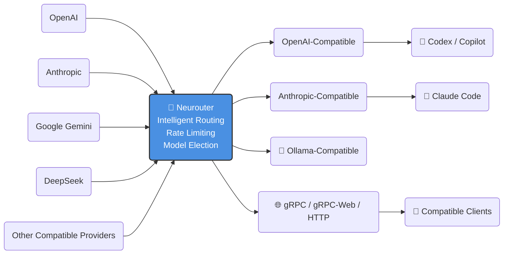

# Neurouter

Neurouter is a powerful LLM router that provides a unified interface for multiple Large Language Model providers. It acts as a proxy service that routes requests to various AI model providers while presenting multiple compatible API interfaces to clients.


```mermaid
graph LR
    D1("OpenAI")
    D2("Anthropic")
    D3("Google Gemini")
    D4("DeepSeek")
    D5("Other Compatible Providers")

    C("🚦 Neurouter<br/>Intelligent Routing<br/>Rate Limiting<br/>Model Election")

    B1("OpenAI-Compatible")
    B2("Anthropic-Compatible")
    B3("🦙 Ollama-Compatible")
    B4("🌐 gRPC / gRPC-Web / HTTP")

    A1("🤖 Claude Code")
    A2("🔧 Codex / Copilot")
    A3("📱 Compatible Clients")

    D1 --> C
    D2 --> C
    D3 --> C
    D4 --> C
    D5 --> C

    C --> B1
    C --> B2
    C --> B3
    C --> B4

    B1 --> A2
    B2 --> A1
    B4 --> A3

    style C fill:#4A90E2,stroke:#333,stroke-width:2px,color:#fff
```

## Features

- **Multi-Protocol API Support**:
  - Native gRPC API (port 9000)
  - Native HTTP/REST API (port 8000)
  - gRPC-Web bridge (enabled by default on the HTTP port)
  - OpenAI-compatible API (Chat Completions + Responses)
  - Anthropic-compatible API (for Claude Code)
  - Ollama-compatible API
- **Multiple Upstream Providers**:
  - OpenAI (and any OpenAI-compatible service, e.g., DeepSeek)
  - Anthropic
  - Google Gemini
  - Neurouter (for chaining instances)
- **Advanced Rate Limiting** (per-upstream and per-model):
  - Tokens Per Minute (TPM) / Tokens Per Day (TPD)
  - Requests Per Minute (RPM) / Requests Per Day (RPD)
  - Concurrent request limits
- **Intelligent Model Election**:
  - Probe-Rank-Reserve strategy for optimal model selection
  - Automatic load balancing with shuffled candidates
- **Observability**:
  - OpenTelemetry tracing, metrics, and logging
  - Prometheus `/metrics` endpoint
  - Per-model token usage metrics
- **Security**:
  - Optional JWT authentication (`NEUROUTER_JWT_KEY` env var)
  - Configurable CORS

## Installation

### Prerequisites

- Go 1.26.0 or later
- Docker (optional)

### Building from Source

```bash
git clone https://github.com/neuraxes/neurouter.git
cd neurouter

make build
```

The binary is output to `bin/neurouter`.

### Using Docker

#### Using Prebuilt Container

```bash
docker run -d \
  --name neurouter \
  -p 8000:8000 \
  -p 9000:9000 \
  -v $(pwd)/configs/upstream.yaml:/configs/upstream.yaml \
  ghcr.io/neuraxes/neurouter:latest
```

The server configuration (`config.yaml`) is baked into the image. Mount your own `upstream.yaml` to configure providers.

#### Building from Dockerfile

```bash
# Build the Go binary first
make build

# Build the Docker image
docker build -t neurouter .

# Run the container
docker run -d \
  --name neurouter \
  -p 8000:8000 \
  -p 9000:9000 \
  -v $(pwd)/configs/upstream.yaml:/configs/upstream.yaml \
  neurouter
```

## Configuration

Neurouter loads all YAML files from the config directory (`-conf configs/`). Configuration is typically split into two files:

### Server Configuration (`configs/config.yaml`)

```yaml
server:
  http:
    addr: "${HTTP_ADDR:0.0.0.0:8000}"
    timeout: "${HTTP_TIMEOUT:600s}"
    cors:
      allowed_origins: ["*"]
      allowed_methods: ["GET", "POST"]
      allowed_headers: ["authorization", "content-type"]
    grpc_web: true # gRPC-Web bridge on HTTP port (default: true)
  grpc:
    addr: "${GRPC_ADDR:0.0.0.0:9000}"
    timeout: "${GRPC_TIMEOUT:600s}"
data:
  enable_event_log: ${ENABLE_EVENT_LOG:false}
  enable_otlp_exporter: ${ENABLE_OTLP_EXPORTER:false}
  enable_prometheus_exporter: ${ENABLE_PROMETHEUS_EXPORTER:false}
auth:
  jwt_key: "${JWT_KEY:}"
```

Environment overrides use the `NEUROUTER_` prefix and are converted to their configured types. Placeholder names in YAML are the post-prefix keys resolved by the environment source; for example, `${JWT_KEY:}` is supplied by `NEUROUTER_JWT_KEY`.

| Environment variable | Configuration value |
| --- | --- |
| `NEUROUTER_HTTP_ADDR` | Native and compatibility HTTP listen address |
| `NEUROUTER_HTTP_TIMEOUT` | HTTP request timeout, such as `30s` |
| `NEUROUTER_GRPC_ADDR` | Native gRPC listen address |
| `NEUROUTER_GRPC_TIMEOUT` | gRPC request timeout, such as `30s` |
| `NEUROUTER_ENABLE_EVENT_LOG` | Enable OTel request and response event logs |
| `NEUROUTER_ENABLE_OTLP_EXPORTER` | Export traces, metrics, and enabled event logs over OTLP |
| `NEUROUTER_ENABLE_PROMETHEUS_EXPORTER` | Expose OTel metrics through the Prometheus endpoint |
| `NEUROUTER_JWT_KEY` | Enable JWT authentication with the supplied signing key |

### Upstream Configuration (`configs/upstream.yaml`)

Defines upstream providers, their models, rate limits, and properties:

```yaml
upstream:
  configs:
    - name: "provider-name"
      models:
        - id: "model-id" # Client-facing model identifier
          upstream_id: "model-id" # Model ID in the upstream service
          name: "Model Name" # Display name
          owner: "owner" # Entity that owns the model
          provider: "provider" # Service provider name
          context_length: 128000 # Max context tokens (optional)
          modalities:
            - "MODALITY_TEXT"
            - "MODALITY_IMAGE"
          capabilities:
            - "CAPABILITY_CHAT"
            - "CAPABILITY_TOOL_USE"
          scheduling: # Per-model rate limits (optional)
            tpm_limit: 100000
            tpd_limit: 1000000
            rpm_limit: 60
            rpd_limit: 1000
            concurrency_limit: 5
      scheduling: # Upstream-level rate limits (optional)
        tpm_limit: 1000000
        tpd_limit: 10000000
        rpm_limit: 600
        rpd_limit: 10000
        concurrency_limit: 50
      # Provider-specific config (one of: open_ai, anthropic, google, neurouter)
      open_ai:
        api_key: "your-api-key"
```

Rate limits are applied at model level first, then upstream level. Set any limit to `0` to disable it.

## Usage

### Running

```bash
# Run after building
./bin/neurouter -conf configs

# With JWT authentication enabled
NEUROUTER_JWT_KEY="your-secret-key" ./bin/neurouter -conf configs
```

### OpenAI-Compatible API

Available under `/v1`, `/openai`, and `/openai/v1` path prefixes:

```bash
# List models
curl http://localhost:8000/openai/v1/models

# Chat completion
curl -X POST http://localhost:8000/v1/chat/completions \
  -H "Content-Type: application/json" \
  -d '{
    "model": "gpt-4",
    "messages": [{"role": "user", "content": "Hello!"}]
  }'

# Chat completion (streaming)
curl -X POST http://localhost:8000/v1/chat/completions \
  -H "Content-Type: application/json" \
  -d '{
    "model": "gpt-4",
    "messages": [{"role": "user", "content": "Hello!"}],
    "stream": true
  }'

# Responses API
curl -X POST http://localhost:8000/v1/responses \
  -H "Content-Type: application/json" \
  -d '{
    "model": "gpt-4",
    "input": "Hello!"
  }'

# Embeddings
curl -X POST http://localhost:8000/v1/embeddings \
  -H "Content-Type: application/json" \
  -d '{
    "model": "text-embedding-ada-002",
    "input": "Hello, world!"
  }'
```

### Anthropic-Compatible API

Available under `/v1`, `/anthropic`, and `/anthropic/v1` path prefixes:

```bash
curl -X POST http://localhost:8000/v1/messages \
  -H "Content-Type: application/json" \
  -H "anthropic-version: 2023-06-01" \
  -d '{
    "model": "claude-sonnet-4-20250514",
    "messages": [{"role": "user", "content": "Hello!"}],
    "max_tokens": 1024
  }'
```

### Ollama-Compatible API

```bash
# List models
curl http://localhost:8000/api/tags

# Model info
curl -X POST http://localhost:8000/api/show \
  -H "Content-Type: application/json" \
  -d '{"model": "gpt-4"}'
```

### Native HTTP API

The Kratos-generated HTTP endpoints use ProtoJSON. Native callers must send `Content-Type: application/protojson` for request bodies and `Accept: application/protojson` for responses. This requirement does not apply to the OpenAI-, Anthropic-, or Ollama-compatible JSON APIs.

```bash
curl -X POST http://localhost:8000/v1/chat \
  -H "Content-Type: application/protojson" \
  -H "Accept: application/protojson" \
  -d '{"model":"gpt-4","messages":[{"role":"USER","contents":[{"text":{"text":"Hello!"}}]}]}'

curl http://localhost:8000/v1/models \
  -H "Accept: application/protojson"
```

The generated Go clients set these headers automatically.

### Native gRPC API

Protocol buffer definitions are in `api/neurouter/v1/`. Available services:

- `ModelServer` — List and query model information
- `ChatServer` — Chat completion with streaming support
- `EmbeddingServer` — Generate text embeddings

gRPC-Web is enabled by default on the HTTP port, allowing browser clients to access gRPC services directly.

## Upstream Providers

### OpenAI (and OpenAI-Compatible Services)

Works with OpenAI and any OpenAI-compatible API (e.g., DeepSeek, Azure OpenAI).

```yaml
name: "openai-main"
models:
  - id: "gpt-4o"
    upstream_id: "gpt-4o"
    name: "GPT-4o"
    owner: "openai"
    provider: "openai"
    context_length: 128000
    modalities: ["MODALITY_TEXT", "MODALITY_IMAGE"]
    capabilities: ["CAPABILITY_CHAT", "CAPABILITY_TOOL_USE"]
open_ai:
  api_key: "sk-..."
  base_url: "https://api.openai.com/v1" # Optional, defaults to OpenAI
  headers: {} # Additional HTTP headers (optional)
  use_responses_api: false # Use Responses API instead of Chat Completions
  responses_use_raw_reasoning: false # Raw CoT reasoning instead of summary
  # Content format preferences (optional, all default to false)
  prefer_string_content_for_system: false
  prefer_string_content_for_user: false
  prefer_string_content_for_assistant: false
  prefer_string_content_for_tool: false
  prefer_single_part_content: false
```

### Anthropic

```yaml
name: "anthropic-main"
models:
  - id: "claude-sonnet-4"
    upstream_id: "claude-sonnet-4-20250514"
    name: "Claude Sonnet 4"
    owner: "anthropic"
    provider: "anthropic"
    context_length: 200000
    modalities: ["MODALITY_TEXT", "MODALITY_IMAGE"]
    capabilities: ["CAPABILITY_CHAT", "CAPABILITY_TOOL_USE"]
anthropic:
  api_key: "sk-ant-..." # API key authentication
  auth_token: "" # Bearer token auth (alternative to api_key)
  base_url: "https://api.anthropic.com" # Optional
  headers: {} # Additional HTTP headers (optional)
  system_as_user: false # Put system prompts into user messages
```

### Google (Gemini)

```yaml
name: "google-main"
models:
  - id: "gemini-2.5-flash"
    upstream_id: "gemini-2.5-flash-preview-04-17"
    name: "Gemini 2.5 Flash"
    owner: "google"
    provider: "google"
    context_length: 1048576
    modalities: ["MODALITY_TEXT", "MODALITY_IMAGE"]
    capabilities: ["CAPABILITY_CHAT", "CAPABILITY_TOOL_USE"]
  - id: "gemini-embedding"
    upstream_id: "gemini-embedding-exp-03-07"
    name: "Gemini Embedding"
    owner: "google"
    provider: "google"
    modalities: ["MODALITY_TEXT"]
    capabilities: ["CAPABILITY_EMBEDDING"]
google:
  api_key: "AIza..."
  system_as_user: false # Put system prompts into user messages
```

### Neurouter (Chaining)

Chain multiple Neurouter instances together via gRPC:

```yaml
name: "neurouter-remote"
models:
  - id: "remote-model"
    upstream_id: "remote-model-id"
    name: "Remote Model"
    owner: "neurouter"
    provider: "neurouter"
    modalities: ["MODALITY_TEXT"]
    capabilities: ["CAPABILITY_CHAT"]
neurouter:
  endpoint: "another-neurouter:9000" # gRPC endpoint of upstream instance
```

## Observability

### OpenTelemetry OTLP Export

Set `data.enable_otlp_exporter` to export traces and metrics over OTLP/gRPC.
Request and response event logs use the same OTLP pipeline when both
`data.enable_event_log` and `data.enable_otlp_exporter` are enabled. All
exporters are disabled by default. Configure the collector with standard
OpenTelemetry environment variables:

```bash
export OTEL_SERVICE_NAME=neurouter
export OTEL_EXPORTER_OTLP_ENDPOINT=http://localhost:4317
export NEUROUTER_ENABLE_OTLP_EXPORTER=true
export NEUROUTER_ENABLE_EVENT_LOG=true
```

Signal-specific settings such as `OTEL_EXPORTER_OTLP_LOGS_ENDPOINT`,
`OTEL_EXPORTER_OTLP_METRICS_ENDPOINT`, and
`OTEL_EXPORTER_OTLP_TRACES_ENDPOINT` override the shared endpoint. Event logs
contain request and response bodies and are disabled by default.

Each upstream model call produces a GenAI client span named
`{gen_ai.operation.name} {gen_ai.request.model}`. HTTP and chained Neurouter
gRPC calls are propagated as child client spans. GenAI spans include routing,
model, response, finish reason, token usage, and error metadata. Prompts, model
outputs, tool definitions, and tool arguments are never recorded in spans.

### Prometheus Metrics

Set `data.enable_prometheus_exporter` to expose OTel metrics from the `/metrics`
endpoint on the HTTP port. The endpoint remains available when the exporter is
disabled and continues to expose metrics registered directly with the default
Prometheus registry, including Go runtime and process metrics. When enabled, the
OTel exporter adds:

- `gen_ai.client.operation.duration` — Upstream GenAI operation duration in seconds
- `gen_ai.client.token.usage` — Input and output token usage distributions
- `gen_ai.client.operation.time_to_first_chunk` — Streaming time to first chunk in seconds

The Prometheus exporter normalizes OTel instrument names and emits histogram
series such as `_bucket`, `_sum`, and `_count`. GenAI metrics are partitioned by
operation, provider, requested upstream model, configured Neurouter model, and
upstream name.

```bash
export NEUROUTER_ENABLE_PROMETHEUS_EXPORTER=true
curl http://localhost:8000/metrics
```

## Security

### JWT Authentication

Set the `NEUROUTER_JWT_KEY` environment variable to enable JWT authentication on all API endpoints:

```bash
export NEUROUTER_JWT_KEY="your-secret-key"
./bin/neurouter -conf configs
```

When enabled, all requests must include a valid JWT token:

```bash
curl -X POST http://localhost:8000/v1/chat/completions \
  -H "Authorization: Bearer YOUR_JWT_TOKEN" \
  -H "Content-Type: application/json" \
  -d '{"model": "gpt-4o", "messages": [...]}'
```

The `/metrics` endpoint is excluded from JWT authentication.

### CORS

CORS is configurable in `config.yaml`:

```yaml
server:
  http:
    cors:
      allowed_origins: ["*"] # Or specific origins
      allowed_methods: ["GET", "POST"]
      allowed_headers: ["authorization", "content-type"]
```

## Supported Modalities

| Enum             | Description        |
| ---------------- | ------------------ |
| `MODALITY_TEXT`  | Text input/output  |
| `MODALITY_IMAGE` | Image input/output |
| `MODALITY_AUDIO` | Audio input/output |
| `MODALITY_VIDEO` | Video input/output |

## Supported Capabilities

| Enum                    | Description           |
| ----------------------- | --------------------- |
| `CAPABILITY_CHAT`       | Chat completion       |
| `CAPABILITY_COMPLETION` | Text completion       |
| `CAPABILITY_EMBEDDING`  | Text embeddings       |
| `CAPABILITY_TOOL_USE`   | Function/tool calling |

## Development

### Prerequisites

- Go 1.26.0

`make init` installs the pinned Buf and Wire versions used by the repository.

### Make Targets

```bash
make init       # Install pinned Buf and Wire versions
make api        # Generate API proto -> *.pb.go, *_grpc.pb.go, *_http.pb.go, errors, openapi.yaml
make config     # Generate internal config proto -> *.pb.go
make generate   # go generate ./... (Wire) + go mod tidy
make all        # api + config + generate
make lint       # Run Buf build/lint and go vet
make test       # Run the full Go test suite
make check-generated # Regenerate and fail if committed output is stale
make build      # Build binary -> bin/neurouter
```

### Running Tests

```bash
make test
```

## License

Licensed under the Apache License, Version 2.0

You may obtain a copy of the License at http://www.apache.org/licenses/LICENSE-2.0
